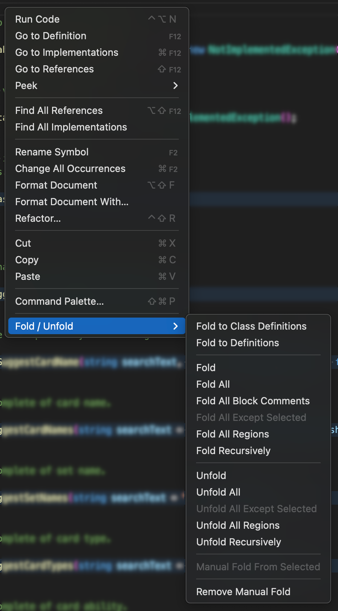

# Right Click Code Folding

* Can't remember the short-cut key for code folding in Visual Studio Code?
* Looking for Collapse to Definitions context menu like Visual Studio? 

This Visual Studio Code extension allows user to right click on the editor, open the context menu to perform fold / unfold / collapse / expand code block without remembering any of the keyboard short-cut.

## Features

Supported command / features:

* **Fold to Definitions**: folds the members of all types.
* **Fold to Definitions**: folds the members of all types and the classes itself.

---
* **Fold**: folds the innermost uncollapsed region at the cursor.
* **Fold Recursively** folds the innermost uncollapsed region at the cursor and all regions inside that region.
* **Fold All Block Comments** folds all regions that start with a block comment token.
* **Fold All Regions**: folds all marker regions.
* **Fold All**: folds all regions in the editor.
* **Fold All Except Selected**: folds all regions in the editor except the selected lines.
* **Unfold**: unfolds the collapsed region at the cursor.
* **Unfold Recursively**: unfolds the region at the cursor and all regions inside that region.
* **Unfold All Regions**: unfolds all marker regions.
* **Unfold All**: unfolds all regions in the editor.
* **Unfold All Except Selected**: unfolds all regions in the editor except the selected lines.

---
* **Manual Fold From Selected**: creates a folding range from the currently selected lines and collapses it.
* **Remove Manual Fold**: remove manual fold range.

## Credit

This extension is created base on source code from

* Fold to Definitions ([https://github.com/zeevro/vscode-fold-to-definitions](https://gitlab.com/georgejames/public/thefoldingstuff/))
* The Folding Stuff ([https://gitlab.com/georgejames/public/thefoldingstuff](https://gitlab.com/georgejames/public/thefoldingstuff/))

## Release Notes

### 1.0.0

Initial release.

